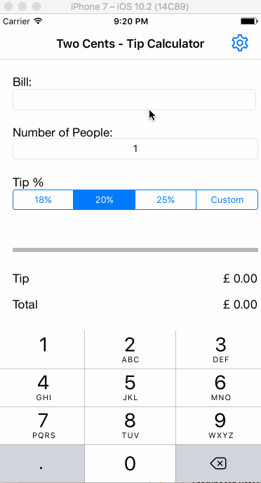

# TwoCents

TwoCents is a Tip Calculator application for iOS submitted as the [pre-assignment](http://courses.codepath.com/snippets/intro_to_ios/prework) requirement for Codepath.

Time spent: 10 hours

Completed:

* [x] Required: Tip Calculator functionality for default and custom %age of tip
* [x] Required: Settings page to change the default tip %age.
* [x] Optional: Settings page to change the default tip currency.
* [x] Optional: Specify # of people for tip
* [x] Optional: Remembering the bill amount across app restarts (if <10mins)
* [x] Optional: Added application icon
* [x] Additional: Making sure the keyboard is always visible and the bill amount is always the first responder. 
      This way the user doesn't have to tap anywhere to use this app. Just launch the app and start typing.
* [x] Additional: Remember tip %age and currency across reboots

Notes:
This app has been testing on iphone 7 simulator

GIF created with [LiceCap](http://www.cockos.com/licecap/).
